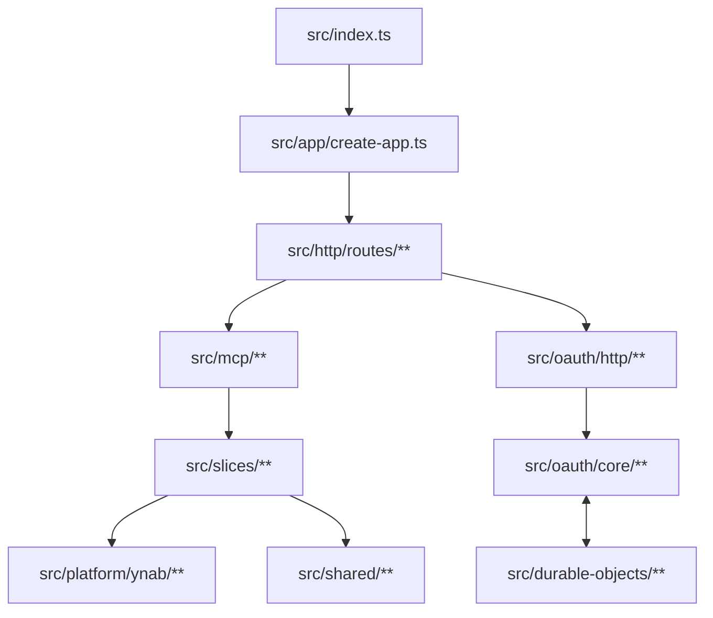

# Architecture

`ynab-mcp-build` is a Cloudflare Workers-native MCP server built from small slice modules with explicit protocol and platform seams.

The v1 product surface is streamable HTTP MCP. The codebase is organized to keep HTTP transport, MCP protocol wiring, YNAB access, and OAuth state management separate.

## Diagram

## Runtime Flow

1. `src/index.ts` exports the Worker `fetch` handler and Durable Object classes.
2. `src/app/create-app.ts` assembles the Hono app and route modules.
3. `src/http/routes/**` owns HTTP request parsing, response writing, route composition, and the streamable HTTP transport adapter.
4. `src/mcp/**` owns MCP server creation, discovery metadata, MCP result shaping, and tool registration wiring.
5. `src/slices/**` owns slice-local business logic and tool definitions consumed by the MCP layer.
6. `src/platform/ynab/**` owns YNAB HTTP access and response mapping.
7. `src/oauth/core/**` owns runtime-agnostic OAuth rules and state transitions.
8. `src/oauth/http/**` adapts HTTP requests to OAuth core services.
9. `src/durable-objects/**` owns strongly consistent OAuth state coordination.

## Layer Model

- Entry: `src/index.ts`
- App composition: `src/app/**`
- HTTP transport: `src/http/**`
- MCP protocol: `src/mcp/**`
- OAuth business logic: `src/oauth/core/**`
- OAuth HTTP adapters: `src/oauth/http/**`
- Durable state adapters: `src/durable-objects/**`
- Platform adapters: `src/platform/**`
- Product slices: `src/slices/**`
- Shared helpers: `src/shared/**`

## Slice Model

Each slice should stay small and grow only when it needs extra seams.

- `index.ts`
- `tools.ts`
- `service.ts`
- `helpers.ts`
- `schemas.ts`
- `mappers.ts`

Do not create placeholder files just to satisfy the pattern.

## Boundary Rules

- `src/index.ts` may import app-composition code and Worker export modules such as Durable Objects.
- `src/http/**` may import `src/mcp/**`, `src/oauth/http/**`, `src/shared/**`, and app-composition helpers.
- `src/http/**` must not contain YNAB API calls or OAuth business rules.
- `src/http/routes/mcp.ts` owns the streamable HTTP transport because it is an HTTP transport concern.
- `src/mcp/**` is the only production layer allowed to import `@modelcontextprotocol/*`.
- `src/mcp/**` owns `registerTool(...)` wiring, MCP result formatting, and server construction.
- `src/slices/**` must not import `@modelcontextprotocol/*`, Hono, Durable Objects, or Worker env directly.
- `src/slices/**` may expose tool definitions, but registration against the MCP server happens in `src/mcp/**`.
- `src/slices/**` service modules may depend on `src/platform/ynab/**` and `src/shared/**` only.
- `src/shared/**` is for runtime-agnostic helpers only. Protocol-specific result formatting does not belong there.
- `src/platform/ynab/**` is the only layer allowed to call YNAB APIs.
- `src/oauth/core/**` must not import Hono, Durable Object classes, or slice modules.
- `src/oauth/http/**` must remain thin adapters over `src/oauth/core/**`.
- `src/durable-objects/**` must not import Hono routes or slice modules.

## Workers-First Rules

- Production code must use web-standard APIs only: `fetch`, `Request`, `Response`, `URL`, `ReadableStream`, `TransformStream`, `crypto.subtle`.
- Do not introduce Node-only APIs in production code.
- Do not introduce Express, stdio-first abstractions, filesystem reads, or process-based configuration paths in production code.
- Worker bindings and secrets must enter through typed env modules, not ad hoc global access.

## OAuth Persistence Rules

- Durable Objects are the canonical store for short-lived OAuth coordination.
- If OAuth is enabled, the app must have either the Durable Object namespace binding or an explicitly injected OAuth store for tests.
- Do not silently fall back to process-local in-memory OAuth state in deployed mode.
- D1 remains optional future storage for long-lived metadata only; it is not a prerequisite for the current architecture.

## v1 Non-Goals

- Stdio as a first-class transport
- Express compatibility
- Node-specific runtime abstractions
- Filesystem-based package/version discovery at request time
- Recreating legacy compatibility layers before the Worker-native seams are stable
